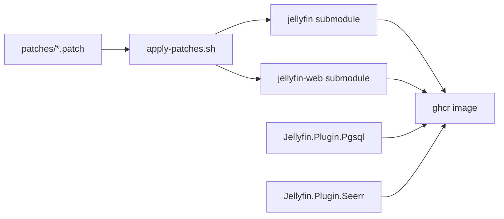

# Architecture

How this repository builds a PostgreSQL-backed Jellyfin image without committing edits into the upstream submodules.

## Repository map

| Path | Role |
|---|---|
| [`Jellyfin.Plugin.Pgsql/`](../Jellyfin.Plugin.Pgsql/) | PostgreSQL EF provider, migrations, query cache, fuzzy search, taste, Emby import, admin APIs |
| [`Jellyfin.Plugin.Seerr/`](../Jellyfin.Plugin.Seerr/) | Seerr/Jellyseerr client plugin (search, request, parental filtering) |
| [`jellyfin/`](../jellyfin/), [`jellyfin-web/`](../jellyfin-web/) | Upstream git submodules — **patch targets only**; keep working trees clean of committed local edits |
| [`patches/`](../patches/) | All server/web customizations as flat `*.patch` files |
| [`scripts/apply-patches.sh`](../scripts/apply-patches.sh) | Routes and applies patches by filename |
| [`scripts/rebase-patches.sh`](../scripts/rebase-patches.sh) | Replays the patch series onto a new Jellyfin tag and rewrites `patches/` |
| [`scripts/sync-jellyfin-migrations.sh`](../scripts/sync-jellyfin-migrations.sh) | Align plugin EF migrations with a Jellyfin release; starts compose `postgres` locally when needed |
| [`scripts/start-dev.sh`](../scripts/start-dev.sh) | Local OIDC/RBAC stack via `docker-compose.dev.yaml` |
| [`docker/`](../docker/) | Production image build (Dockerfile, entrypoint, migrator) |

Agent-oriented rules (never commit submodule dirt, auth checklist, JSON casing) live in [`AGENTS.md`](../AGENTS.md).

## Patch routing and apply order

[`scripts/apply-patches.sh`](../scripts/apply-patches.sh) takes a target (`jellyfin` or `jellyfin-web`) and applies matching files from `patches/`:

| Filename pattern | Applied to |
|---|---|
| `jellyfin_web*.patch` | `jellyfin-web/` |
| `jellyfin_*.patch` or `jellyfin.patch` | `jellyfin/` (web names excluded) |

**Web is matched first.** A name starting with `jellyfin_web` is never applied to core.

Patches are applied in **lexicographic order** (`ls | sort`). Prefixes encode layering:

- Unprefixed thematic names apply in alphabetical order among themselves.
- `jellyfin_z_*` / `jellyfin_web_z_*` run late so they can edit files already touched by earlier patches.
- `jellyfin_zz_*` / `jellyfin_web_zz_*` run last (for example person identity, Emby import UI).

Some patches document explicit prerequisites in a `#` preamble when apply order matters beyond lexicographic sort. Those comments are authoritative when refreshing patches.

When bumping Jellyfin tags, do **not** hand-edit hunk line numbers. Replay the series:

```bash
./scripts/rebase-patches.sh --from v12.0-rc4 --to v12.0-rc5
```

That applies each patch as a commit on `--from`, `git rebase --onto` the new tag, and writes updated `patches/*.patch` files. Hunks that only fail because surrounding lines moved are merged automatically. Remaining **content** conflicts are reported (patch name + files) and must be resolved with `export-patch.sh`. SQLite `*ModelSnapshot.cs` conflicts are skipped by keeping the new upstream snapshot (this fork’s schema lives in plugin migrations). `sync-jellyfin-migrations.sh` runs this automatically when the target tag differs from [`.github/jellyfin-sync-state.json`](../.github/jellyfin-sync-state.json).

```bash
# Used by Docker / CI
./scripts/apply-patches.sh jellyfin
./scripts/apply-patches.sh jellyfin-web

# After editing a clean submodule checkout
git -C jellyfin diff > patches/jellyfin_<name>.patch
git -C jellyfin-web diff > patches/jellyfin_web_<name>.patch
git -C jellyfin checkout -- .
git -C jellyfin-web checkout -- .
```

## Build composition



During `docker build` ([`docker/Dockerfile`](../docker/Dockerfile)):

1. Submodules are checked out at the pinned Jellyfin tag (server and web stay on the **same** feature/release tag).
2. `apply-patches.sh` runs for web (web-build stage) and for server (build stage).
3. Patched sources are compiled; plugins are packaged into the image.
4. Entrypoint wires `POSTGRES_*` / optional Redis / optional SSO env vars and can run SQLite→PG migration.

CI workflows (build, test, publish) apply jellyfin patches the same way.

**Migration sync and patches:** fork schema (playback activity, taste entities, people provider key, indexes, …) belongs in **dedicated** plugin migrations authored with the patch. Sync does **not** use `Update_*` to capture patch schema. On each version bump it rebases `patches/` onto the new tag, applies server patches, builds the solution (API surface check), optionally generates `Update_*` when core SQLite migrations advanced, then resets the submodule.

## Plugin modules (high level)

Inside `Jellyfin.Plugin.Pgsql`:

| Area | Responsibility |
|---|---|
| `Database/` | Npgsql provider, connection string / timeout, backups |
| `Migrations/` | PostgreSQL EF migrations (synced from Jellyfin + fork entities) |
| `Query/` | Latest/Resume/NextUp cache and PG-optimised Latest SQL |
| `Search/` | Trigram / franchise-oriented fuzzy search (`<%` / `jellyfin_word_similar` on GIN) |
| `Taste/` | Profile rebuild, scoring, recommendations |
| `Api/` | Taste, Emby import, user admin, plugin stats controllers |
| `Admin/EmbyImport/` | Emby SQLite userdata import pipeline |
| `Playback/` | Playback-reporting import helpers (where applicable) |

`Jellyfin.Plugin.Seerr` talks to an external Seerr/Jellyseerr instance (URL + API key in plugin config) and is consumed by web search / Beyond Your Library patches.

## Migration sync (summary)

A scheduled workflow detects new Jellyfin releases, bumps refs (including **both** `jellyfin` and `jellyfin-web` to the same tag), rebases `patches/` onto that tag, verifies they apply, and opens a collaborator-only PR. Docker publish is blocked until sync state matches the target version. Failures open/update issues labeled `migration-sync-failure` (see [known issues](known-issues.md)).

`Update_*` PostgreSQL migrations are generated **only when Jellyfin’s SQLite migration set advances**. Tag-only bumps (same latest core migration id) update version refs and submodule pointers, verify patches, and **build the solution** against patched jellyfin (so new interface members and other API breaks fail sync early), but skip EF. When an `Update_*` is needed, SQLite migrations are **not** copied — EF diffs the patched design-time model against the existing PG snapshot (upstream delta only, assuming fork schema already has dedicated migrations), then post-processes PG-specific fixes and validates against Postgres. Local sync starts `docker-compose.dev.yaml` postgres (not Jellyfin or Keycloak) if nothing is listening, **before** bumping refs or generating the migration, so a missing database does not generate `Update_*` and then roll it back. CI uses the workflow Postgres service instead.

Operator-facing sync and release steps: [README — Release flow](../README.md#release-flow).

## Submodule hygiene

- Do **not** commit modified files inside `jellyfin/` or `jellyfin-web/`.
- Always export diffs to `patches/` and reset submodule trees after editing.
- Bumping Jellyfin versions means advancing **both** submodule pointers to the same tag.
