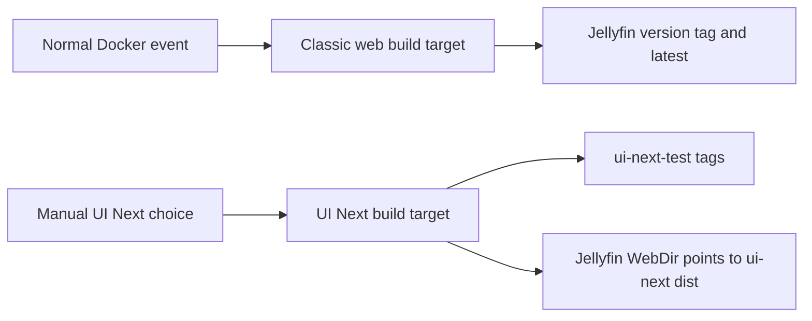

# UI Next Docker test image

**Status:** Draft for review  
**Date:** 2026-10-10

## Goal

Build an opt-in Jellyfin image that serves UI Next at `/web` for early testing. Keep the existing image tags and default Docker build on the patched Jellyfin web client until the UI Next test is accepted.

## Requirements

- Normal pushes, releases, scheduled builds, and default manual builds continue to publish the patched classic web client as the Jellyfin UI.
- A manual Docker workflow choice builds an image that serves UI Next from Jellyfin's configured web directory.
- The UI Next test image publishes only `ui-next-test` and `ui-next-test-<JELLYFIN_VERSION>` tags. It does not publish `latest` or overwrite the ordinary Jellyfin-version tag.
- Both variants use the same pinned Jellyfin server, plugins, and runtime setup.
- The Docker build context excludes local `ui-next/.env*` files, and the UI Next build stage copies only the inputs needed for the static build.
- The image workflow does not run a Docker build locally. A maintainer starts the published-image workflow after the change is reviewed and merged.

## Current flow

`docker/Dockerfile` builds patched `jellyfin-web` with Node and copies its static output to `/jellyfin/jellyfin-web`. The Jellyfin server defaults `JELLYFIN_WEB_DIR` to that directory and serves it at `/web`. `.github/workflows/docker.yaml` builds that Dockerfile and publishes both the Jellyfin-version tag and `latest`.

UI Next already builds a static bundle into `ui-next/dist/` with `npm ci` and `npm run build`. Vite uses a relative asset base, so the bundle can load from `/web/index.html`. The server accepts `JELLYFIN_WEB_DIR` as an environment override.

## Approaches

### 1. Separate Docker target and opt-in test tags (selected)

Add a Node build stage for UI Next and a named final Docker target that reuses the same Jellyfin runtime and plugin layers. The target copies `ui-next/dist/` to `/jellyfin/ui-next` and sets `JELLYFIN_WEB_DIR=/jellyfin/ui-next`. Keep the current classic image as the Dockerfile's default target.

Add a manual choice to `docker.yaml`. The normal choice builds the classic target and publishes the current version and `latest` tags. The UI Next choice builds the UI Next target and publishes `ui-next-test` and `ui-next-test-<JELLYFIN_VERSION>` only.

This isolates early UI testing from normal users and uses Jellyfin's existing static-web directory setting. It adds one static build stage and two explicit image targets.

### 2. Replace the UI in the existing image tags

Make UI Next the default Docker target and publish it under the current version and `latest` tags. This is the smallest workflow change, but it puts an experimental client on all existing image tags and makes rollback depend on a new image build.

### 3. Serve both clients from separate routes

Keep the classic UI at `/web` and add a second route for UI Next. Jellyfin currently serves one configured web directory at `/web`; a second static route would need a server patch or a separate reverse proxy. That adds routing and patch maintenance which the test image does not need.

## Selected design

The `ui-next` build stage copies `package.json`, `package-lock.json`, `tsconfig.json`, `vite.config.ts`, `index.html`, and `src/` from `ui-next/`. It runs `npm ci` and `npm run build`. The Docker ignore rules exclude local `.env` files and generated `dist/` output. The UI Next final target uses the shared runtime stage but does not depend on the patched `jellyfin-web` build stage. The standard target remains the final default stage and retains its existing SSO script injection.

The UI Next target serves its build at `/web` through `JELLYFIN_WEB_DIR`. It does not inject the classic SSO login script because UI Next has its own SSO entry points.

UI Next's "Classic dashboard" and "Metadata manager" links point back to `/web`. Those links would open UI Next again in this image. A build-time `VITE_CLASSIC_WEB_AVAILABLE=false` flag hides those links only in the test image. The standard UI Next development build keeps its current links. The server's `/web/ConfigurationPages` and `/web/ConfigurationPage` controller endpoints remain available for plugin settings.

The manual workflow choice defaults to the classic image. Selecting UI Next pushes the mutable `ui-next-test` tag and a Jellyfin-version-specific `ui-next-test-<JELLYFIN_VERSION>` tag. It never changes the normal version tag or `latest`.

## Validation and rollback

- Build UI Next with its checked-in lockfile and run its TypeScript/Vite production build.
- Confirm Docker ignore rules exclude `ui-next/.env*` and the build stage does not copy them.
- Validate `docker.yaml` syntax and confirm each branch selects the intended Docker target and tags.
- Inspect both final Docker targets and verify their web directories and SSO handling.
- Do not run `docker build`, publish an image, or dispatch the workflow as part of implementation.
- To roll back a test deployment, point its Compose file back to the existing Jellyfin-version tag. The stable tags are unchanged by the UI Next workflow choice.

## Known test limits

The UI Next client remains experimental. The test image will not route the classic dashboard or metadata manager from `/web`; the UI hides those links. Physical TV and wrapper compatibility remains a separate live test.
